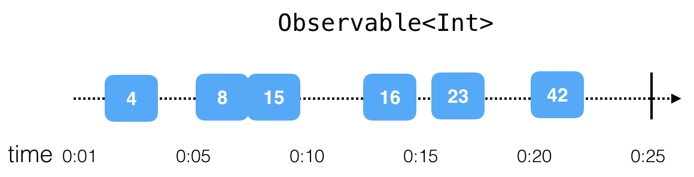
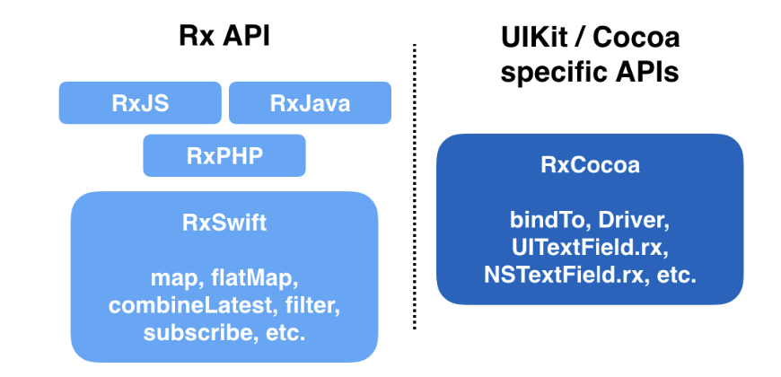

## Rxswift 
simplifies developing asynchronous program by allowing your code to react to new data and process it in a sequential, isolated manner.

## Existing methods to perform asynchronous programming 

1. NotificationCenter
2. The delegate Pattern
3. GCD 
4. Closures
5. Combine from ios 13.0


## The three building blocks of Rx code are observables, operators and schedulers. The sections below cover each of these in detail.

### 1. Observables 
Observable<`Element`>

Its foundation of RxCode. It allow conusmers to subscribe for events or values, emitted by another object over time in `asynchronous manner`.



To get an idea about some real-life situations, you’ll look at two different kinds of observable sequences: `finite and infinite`.

finite : like download something.

infinite : like observering device rotation.


### 2. Operator 

these are composable so you can make chain with them.

like:  filter, map

```swift
UIDevice.rx.orientation 
  .filter { $0 != .landscape }
  .map { _ in "Portrait is the best!" }
  .subscribe(onNext: { string in
    showAlert(text: string)
  })
```

### 3. Schedulers

Schedulers are the Rx equivalent of dispatch queues or operation queues — just on steroids and much easier to use. They let you define the execution context of a specific piece of work.


## RxCocoa

RxCocoa is RxSwift’s companion library holding all classes that specifically aid development for UIKit and Cocoa.


For example, it’s very easy to use RxCocoa to subscribe to the state changes of a UISwitch, like so:

```python
toggleSwitch.rx.isOn
  .subscribe(onNext: { isOn in
    print(isOn ? "It's ON" : "It's OFF")
  })
```

