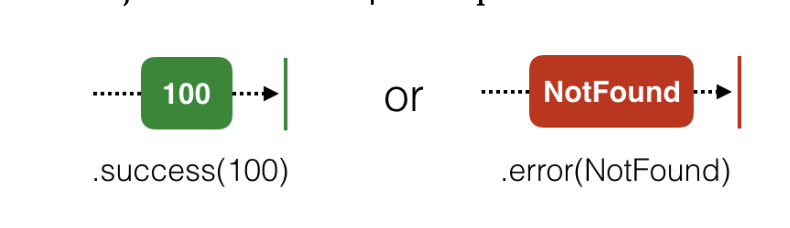
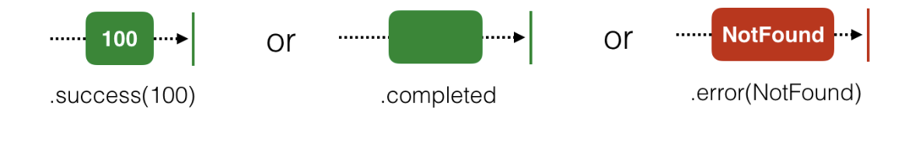
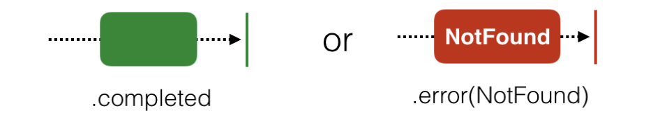

## Subjects 

A common need when developing apps is to manually add new values onto an observable during runtime to emit to subscribers.   
What you want is something that can act as both an `observable` and as an `observer`. That something is called a `Subject`.

## type of subjects 

`PublishSubject`: Starts empty and only emits new elements to subscribers.   
```swift
  let subject = PublishSubject<String>()
```

`BehaviorSubject`: Starts with an initial value and replays it or the latest element to new subscribers.  
```swift
  let subject = BehaviorSubject<String>(value: "Initial value")
```

`ReplaySubject`: Initialized with a buffer size and will maintain a buffer of elements up to that size and replay it to new subscribers.

```swift
  let subject = ReplaySubject<String>.create(bufferSize: 2)
```

----
### Realy   

RxSwift also provides a concept called Relays. RxSwift provides two of these, named `PublishRelay` and `BehaviorRelay`. These wrap their respective subjects, but only accept and relay next events. You `cannot` add a `completed` or `error` event onto relays at all, so they’re great for non-terminating sequences.


```swift
  let relay = BehaviorRelay<String>(value: "intial value")
  
  relay.subscribe { ele in
      print(ele.element ?? "NA")
  }
  .disposed(by: dispose)

  relay.accept("next value 2")

```


### other examples 

```markdown
• Observable.never(): Creates an observable sequences that never emits any elements. 

• Observable.just(_:): Emits one element and a .completed event.

• Observable.empty(): Emits no elements followed by a .completed event.

• Observable.error(_): Emits no elements and a single .error event.

```


## RxSwift traits in practice

will be useful in term of memory release bcz mostly we are storing all subcription in dispose bag so to avoid this we can use these.

also we can go for manually in diddisAppear with on completed event to release respected one.

### 1. Single 

emit just once either a .success(Value) event or an .error. Under the hood, a .success is just .next + .completed pair.



### 2. MayBe 

Maybe is quite similar to Single with the only difference that the observable may not emit a value upon successful completion.




### 3. Completable

variation of Observable allows only for a single .completed or .error event to be emitted before the subscription is disposed of


