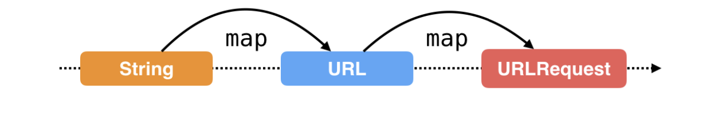
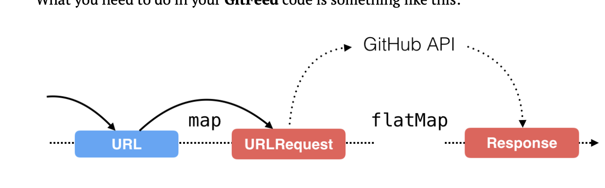

## API Call



```swift
func fetchEvents(_ repo: String) {
        
     Observable.from([repo])
        .map { strURL -> URL in
                return URL(string: "https://api.github.com/repos/\(strURL)/events")!
            }
        .map { url -> URLRequest in
                return URLRequest(url: url)
            }
            ....
        
}
```

so simply map used to transform one form to other as we can see above 


## Using flatMap to wait for a web response



```swift
.flatMap { request -> Observable<(response: HTTPURLResponse, data: Data)>  in
                return URLSession.shared.rx.response(request: request)
            }
```

##  share() vs. share(replay: 1)

after flatmap it will return result either with next/complete or with error.

and another subcriber will come and subcribe then has to go again for same request so avoid this we will use share() with or without replay count.

This operator keeps a buffer of the last replay elements emitted and feeds them to any newly subscribed observers
Therefore, if your request has completed and a new observer subscribes to the shared sequence (via share(replay:scope:)), it will immediately receive the buffered response from the previously-executed network request.

Let's see how the app would behave when using either scope: 

• .forever: the buffered network response is kept forever. New subscribers get the buffered response.   

• .whileConnected: the buffered network response is kept until there are no more subscribers, and is then discarded. New subscribers get a fresh network response.


```swift
func fetchEvents(_ repo: String) {
        let response = Observable.from([repo])
            .map { strURL -> URL in
                print("url requet")
                return URL(string: "https://api.github.com/repos/\(strURL)/events")!
            }
            .map { url -> URLRequest in
                return URLRequest(url: url)
            }
            .flatMap { request -> Observable<(response: HTTPURLResponse, data: Data)>  in
                return URLSession.shared.rx.response(request: request)
            }
            .share(replay: 1) // without this both reponse will new api again again so better to use this ... can .share() only also in our case
        
        
        response.filter { res, _ in
                return (200...299) ~= res.statusCode
            }
            .map { _ , data -> [EventsData]  in
                let res = try? JSONDecoder().decode([EventsData].self, from: data)
                return res ?? []
            }
            .filter({$0.count != 0})
            .subscribe( onNext: { data in
                print(data)
            })
            .disposed(by: dispose)
        
        response
            .filter { response, _ in
            return 200..<400 ~= response.statusCode
          }
        .flatMap({ response, _ -> Observable<String> in
            guard let value = response.allHeaderFields["Last-Modified"] as? String
          else {
              return Observable.empty()
            }
            return Observable.just(value)
          })
        .subscribe(onNext: { [weak self] modifiedHeader in
          guard let self = self else { return }
            print("modifiedHeader \(modifiedHeader)")
          //self.lastModified.accept(modifiedHeader)
         // try? modifiedHeader.write(to: self.modifiedFileURL, atomically: true,
            //encoding: .utf8)
        })
        .disposed(by: dispose)
    }
```