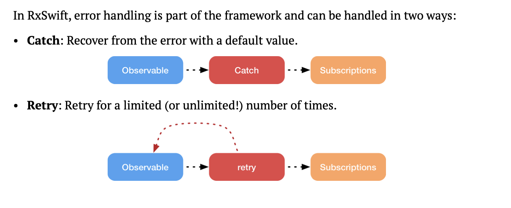
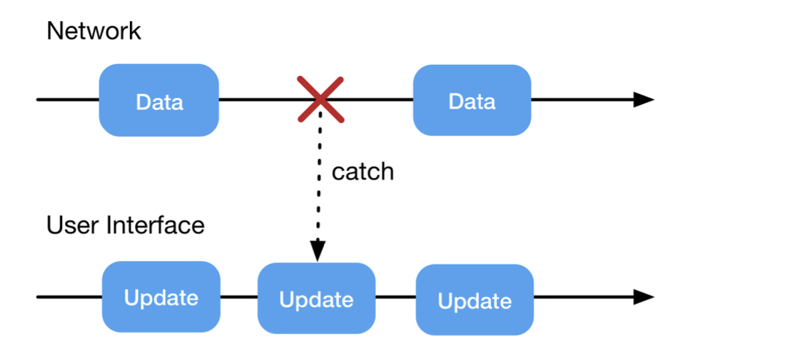
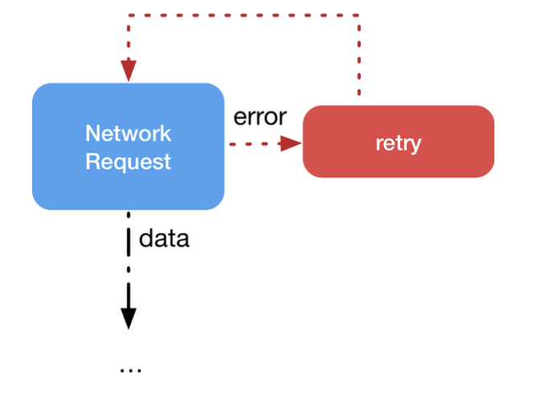

## Managing errors




## Handle errors with catch

> catch operator works much like the do-try-catch flow in plain Swift.

in rxswift we have two operators: 

## 1. catchError 

```swift
  func catchError(_ handler:) -> RxSwift.Observable<Self.E>
```

its giving option to update data whene there is error with help of handler or you can take decision accoriding to error.


for example: can return cache data 

## 2. catchErrorAndJustReturn

```swift
  func catchErrorJustReturn(_ element:) -> RxSwift.Observable<Self.E>
```

in this we have already used, here we will return dummy or predefined data like we did in earlir api call (weather request return dummy data if searched country does not exist)


## why its so important ? 
if we dont control error then that observaable will fire error and will stop or can say have completed with error.

example: search one if we will not return empty result on error then after error it will not work at all.


## for example caching results 




## Retrying on error



### 1.  Retry operators

```swift
func retry() -> RxSwift.Observable<Self.E>
```

it for unlimited time but its not suggested way bcz its resource heavy but can consider in network check 

### 2. retry(_ maxAttemptCount:)

```swift
func retry(_ maxAttemptCount:) -> Observable<E>
```

```swift
   let result = search
            .flatMapLatest { enterText in
                return APIController.shared.currentWeather(city: enterText)
                    .do { [weak self] data in
                        self?.cache[enterText] = data
                    }
                    .retry(2) 
                    // it will check only 2 time and after that means on third time it will return error
                    .catch { error in
                        print(error.localizedDescription)
                        print("self.cache \(self.cache)")
                        if let re = self.cache[enterText] {
                            return Observable.just(re)
                        }
                        return Observable.just(APIController.Weather.empty)
                    }
            }
            .asDriver(onErrorJustReturn: APIController.Weather.empty)
```


### 3. Advanced retries

pending...


## Custom errors


