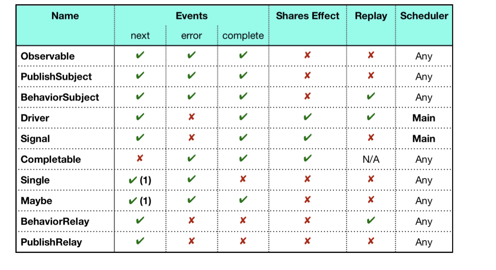

## Binding observables

An important thing to know here is that in RxCocoa, a binding is a `uni-directional` stream of data.


```markdown
• A producer, which produces the value
• A consumer, which processes the values from the producer
A consumer cannot return a value. This is a general rule when using bindings of RxSwift.
```


example in gitRepo

## Improving the code with Traits

```markdown
It might be confusing at first, but the rules of using RxCocoa's traits make the whole concept a little easier to understand. The rules of these are:
• They can’t error out.
• They are observed on main scheduler.
• They subscribe on main scheduler.
• They share resources (e.g. share(replay: 1)), except for Signal.

These entities ensure something is always displayed in the user interface and that they are always able to be handled by the user interface.
The RxCocoa Traits are:
• ControlProperty and ControlEvent 
• Driver
• Signal
```

### ControlProperty : 
to bind the data to the correct user interface component using the dedicated rx namespace.

### ControlEvent:  
is used to listen for certain event of UI components.
A control event is available if the component uses UIControl.Events.

Like: text changed, button tapped

### Driver:

Driver is a `special observable` with the same constraints as explained before, so it can’t error out.    
All processes are ensured to execute on the main thread, which avoids making UI changes on background threads.

### Signal
---- 

Examples: 

Without Driver 

```swift
    let s = textField.rx.text.orEmpty
            .flatMapLatest { enterText in
                return APIController.shared.currentWeather(city: enterText)
                    .catchAndReturn(APIController.Weather.empty)
            }
            .observe(on: MainScheduler.instance)
            .share(replay: 1)

```

With Driver 

```swift
    let search = textField.rx.text.orEmpty
            .filter{ !$0.isEmpty }
            .flatMapLatest { enterText in
                return APIController.shared.currentWeather(city: enterText)
                    .catchAndReturn(APIController.Weather.empty)
            }
            .asDriver(onErrorJustReturn: APIController.Weather.empty)
```


`.asDriver(...).` This is the method that converts your observable into a Driver. 
The `onErrorJustReturn` parameter specifies a default value to be used in case the observable `errors out` — thus eliminating the possibility for the driver itself to emit an error.


---
## Recap of Traits in RxSwift and RxCocoa

